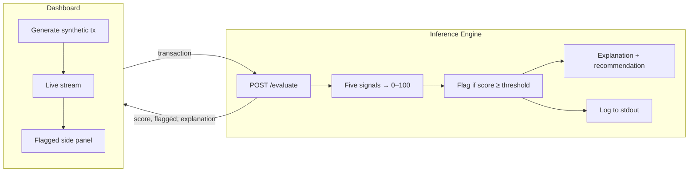
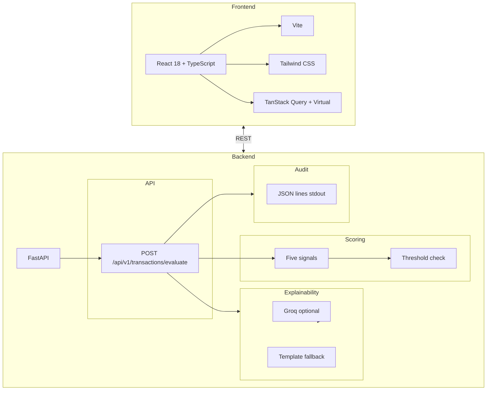

# SecureFlow

<div style="margin: -10px 0;" align="center">
           <br />
  <p align="center">
    <a href="https://devpost.com/software/secureflow-ceoj4p">
      <strong>« IBM Z Mini Hackathon — DevPost »</strong>
               <br />
    </a>
  </p>
</div>

Catch fraud before it happens — not after. SecureFlow is a real-time fraud detection demo that scores every transaction in under 100 milliseconds, explains every flagged decision in plain English, and logs everything for audit. Inspired by IBM's Telum chip on the z16 mainframe: we simulate putting AI inference right in the transaction path, so you can block or hold **before** approval instead of cleaning up afterward.

<div align="center">
  <a href="https://www.youtube.com/watch?v=w2yAfle7tlc">
    
  </a>
</div>

---

## The Problem

Most fraud detection today runs **after** the transaction is done. By the time a bank or card network flags something, the money has often already moved. That means more loss, more customer friction, and more compliance risk — and regulators want to know *why* a decision was made, not just a black-box score. SecureFlow exists because **fraud scoring and explainability should happen at the point of transaction**, in milliseconds, so you can act before approval and always show your reasoning.

---

## How It Works

SecureFlow has three layers: a **Transaction Simulator** (dashboard), an **Inference Engine** (API), and an **Explainability Layer**. The dashboard sends synthetic transactions to the API; the API scores each one in real time and returns a risk score (0–100), a flag (above a configurable threshold), and — when flagged — a plain-English explanation and a recommendation (Hold, Verify, or Approve with warning). Every decision is logged for audit.

### High-Level Flow



### Inference Pipeline

Each transaction (amount, currency, merchant, country, timestamp, user/device) is scored using **five signals**: amount vs user average, geographic anomaly (e.g. new country), transaction velocity (tx count in last hour), merchant category deviation, and time-of-day anomaly. Contributions are summed into a 0–100 risk score. If the score is at or above the threshold (default 35 for demo), the transaction is **flagged**. For flagged transactions we build an explanation: either via **Groq** (when `GROQ_API_KEY` is set) for natural-language text, or via templates from the signal descriptions. A rule-based recommendation (Hold / Verify / Approve with warning) is returned with the response. The hot path stays under 100 ms; audit writes are synchronous (one JSON line per decision to stdout).

### Dashboard

The React dashboard runs a **live stream**: at a configurable interval it generates a synthetic transaction (optionally with fraud-like patterns in **Demo mode**), POSTs it to the API, and appends the result to a virtualized list. Each row shows amount, merchant, score, latency (ms), and OK or **Flagged**. Clicking a flagged row opens a **side panel** with the full explanation, the list of signals that contributed, and the recommendation. A **latency meter** (last + P95) and a **risk gauge** show that we stay under the 100 ms target and surface the latest score.

---

## System Architecture



### Frontend

- **React 18 + TypeScript + Vite** for the dashboard; **Tailwind CSS** for layout and styling.
- **TanStack Query** for request state; **TanStack Virtual** for the transaction list so it stays fast at high volume.
- Synthetic transaction generator in `src/lib/synthetic.ts`; **Demo mode** injects more fraud-like patterns (high amount, new country) so you see flags quickly.

### Backend

- **FastAPI** with Pydantic request/response models. Single endpoint: `POST /api/v1/transactions/evaluate`.
- **In-process scoring** (no DB in the hot path): five signal functions, aggregate 0–100, configurable threshold via `SECUREFLOW_THRESHOLD`.
- **Explainability:** Groq (when `GROQ_API_KEY` is set) or template-based text; recommendation from score bands.
- **Audit:** Every decision written as one JSON line to stdout (transaction_id, score, threshold, flagged, signals, timestamp, explanation).

---

## Technical Implementation

### Scoring Signals

- **Amount vs average:** User running average (exponential smoothing); ratio &gt; 10 → 35 pts, else bands up to 20.
- **Geographic:** Per-user “home” country; transaction from a different country → 25 pts.
- **Velocity:** Per-user tx timestamps in a 60-minute window; count &gt; 5 → up to 20 pts.
- **Merchant category:** Per-user set of seen categories; new category → 14 pts.
- **Time of day:** 2–5 AM → 16 pts; outside 6–23 → 10 pts.

All state is in-memory (dicts keyed by user_id) for the demo; no database in the request path.

### Explainability

For flagged transactions we call `get_explanation(signals, score)`: if `GROQ_API_KEY` is set we call Groq (e.g. `llama-3.1-8b-instant`) with the signal list and score to produce a short paragraph; on failure or missing key we use concatenated signal descriptions. Recommendation is rule-based: score ≥ 90 → Hold, ≥ 75 → Verify, else Approve with warning.

### Demo Mode

The frontend’s synthetic generator can inject “high amount” (1200–3700, foreign country) or “new country” (JP) for a share of transactions. With **Demo mode** checked, ~60% of transactions use these patterns so the backend frequently crosses the threshold and you see flagged rows without waiting.

---

## Tech Stack

| Layer     | Technology              | Purpose                                  |
| --------- | ----------------------- | ---------------------------------------- |
| Frontend  | React 18, TypeScript, Vite | Dashboard, stream, side panel         |
| Styling   | Tailwind CSS            | Layout, risk gauge, latency meter        |
| Data / UI | TanStack Query, TanStack Virtual | API state, virtualized list      |
| Backend   | FastAPI, Python 3       | Evaluate API, scoring, explainability   |
| Validation| Pydantic                | Request/response schemas                 |
| AI (opt.) | Groq                    | Natural-language explanations            |
| Audit     | Structured JSON (stdout)| One line per decision                    |
| Deploy    | Docker Compose           | Backend + frontend containers            |

---

## API Design

With the backend running, full OpenAPI docs are at **http://localhost:8000/docs**.

### Evaluate endpoint

| Method | Endpoint                              | Description |
| ------ | ------------------------------------- | ----------- |
| POST   | `/api/v1/transactions/evaluate`       | Submit a transaction; returns score, flagged, latency_ms, and (when flagged) explanation, signals, recommendation. |

**Request body:** `amount`, `currency`, `merchant_id`, `merchant_category`, `country`, `timestamp` (ISO), optional `user_id`, `device_id`, `transaction_id`.

**Response:** `transaction_id`, `score`, `flagged`, `latency_ms`, `threshold`, `signals[]`, `explanation?`, `recommendation?`.

### Health

| Method | Endpoint | Description |
| ------ | -------- | ----------- |
| GET    | `/health` | Returns `{ "status": "ok", "threshold": <value> }`. |

---

## Project Structure

```
IBM Z Mini Hackathon TTW/
├── docs/
│   ├── SecureFlow_PRD.md      # Product requirements
│   ├── SecureFlow_Tech_Stack.md
│   ├── EXECUTION_PLAN.md
│   ├── DEMO_GUIDE.md
│   ├── DEMO_VIDEO_SCRIPT.md    # 3-min demo script
│   └── DEVPOST.md              # Devpost submission text
├── backend/
│   ├── app/
│   │   ├── main.py             # FastAPI app, evaluate route
│   │   ├── models.py           # Pydantic request/response
│   │   ├── scoring.py         # Five signals, aggregate score
│   │   ├── explainability.py  # Groq + template, recommendation
│   │   └── audit.py           # JSON line per decision
│   ├── requirements.txt
│   ├── .env.example
│   └── Dockerfile
├── frontend/
│   ├── src/
│   │   ├── components/        # Dashboard, TransactionStream, LatencyMeter, RiskGauge, FlaggedSidePanel
│   │   ├── api/client.ts
│   │   ├── lib/synthetic.ts
│   │   └── types.ts
│   ├── package.json
│   ├── vite.config.ts
│   └── Dockerfile
├── docker-compose.yml
├── .env.example
└── README.md
```

---

## Getting Started

### Prerequisites

- **Node.js 18+** and npm  
- **Python 3.10+**  
- **Optional:** [Docker](https://docs.docker.com/get-docker/) and [Docker Compose](https://docs.docker.com/compose/install/)  
- **Optional:** [Groq](https://console.groq.com/) API key for AI-generated explanations  

### Quick start (local)

1. **Backend**
   ```bash
   cd backend
   python -m venv .venv
   .venv\Scripts\activate   # Windows
   # source .venv/bin/activate  # macOS/Linux
   pip install -r requirements.txt
   uvicorn app.main:app --reload --host 0.0.0.0 --port 8000
   ```

2. **Frontend**
   ```bash
   cd frontend
   npm install
   npm run dev
   ```

3. Open **http://localhost:5173**. Check **Demo mode**, click **Start stream**, and click any **Flagged** row to open the explanation side panel.

**API:** http://localhost:8000  
**API docs:** http://localhost:8000/docs  
**Dashboard:** http://localhost:5173  

### Optional: API keys and config

- Copy `backend/.env.example` to `backend/.env` (or set env vars).
- **`GROQ_API_KEY`** — Enables Groq for natural-language explanations on flagged transactions. Without it, template-based text is used.
- **`SECUREFLOW_THRESHOLD`** — Risk score above which a transaction is flagged (default 35 for demo). Increase (e.g. 50–75) for fewer flags.

### Docker

From the project root:

```bash
docker compose up --build
```

- **Backend:** http://localhost:8000  
- **Frontend:** http://localhost:5173 (or port 80 if served by nginx in the dashboard image)  
- Set `GROQ_API_KEY` and `SECUREFLOW_THRESHOLD` in the backend service environment as needed.

| Command                     | Description           |
| --------------------------- | --------------------- |
| `docker compose up -d`      | Run in background     |
| `docker compose down`       | Stop and remove       |
| `docker compose logs -f api`| Stream backend logs   |

---

## Documentation

- **Product & submission:** [docs/SecureFlow_PRD.md](docs/SecureFlow_PRD.md), [docs/DEVPOST.md](docs/DEVPOST.md)  
- **Tech stack:** [docs/SecureFlow_Tech_Stack.md](docs/SecureFlow_Tech_Stack.md)  
- **API:** http://localhost:8000/docs when the backend is running  

---

## Troubleshooting

- **400 Bad Request** — Check backend logs; ensure `backend/app/scoring.py` uses `timedelta` for the velocity window (no `replace(minute=...)`).
- **Proxy / network errors** — Start the backend first on port 8000; frontend proxies `/api` only when using `npm run dev`. If needed, set proxy target to `http://127.0.0.1:8000` in `frontend/vite.config.ts`.
- **422 Unprocessable Entity** — Request body must include `amount`, `currency`, `merchant_id`, `merchant_category`, `country`, `timestamp` (ISO string); optional `user_id`, `device_id`. Check the response `detail` array in the Network tab.
- **No flagged transactions** — Enable **Demo mode** on the dashboard and ensure backend default threshold is 35 (or set `SECUREFLOW_THRESHOLD` lower).

---

## Inspiration: IBM Telum

SecureFlow is inspired by **IBM’s Telum processor** in the IBM z16 mainframe, which performs AI inference **on-chip** during transaction execution. We don’t run on Telum hardware; we **simulate the idea** in software: our API scores every transaction in the same request path and returns the decision in milliseconds, so stakeholders can see what “real-time fraud detection at the point of transaction” looks like — and why it matters for security, compliance, and trust.

---

## License

MIT License — see [LICENSE](LICENSE) for details if present.
